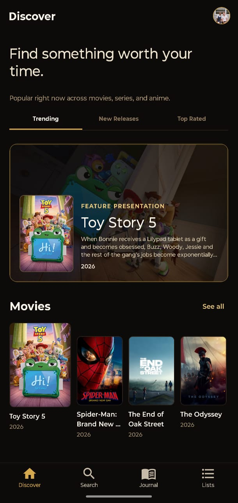
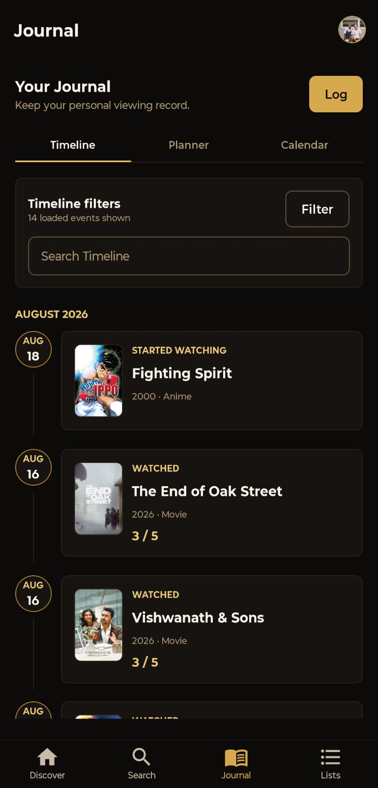
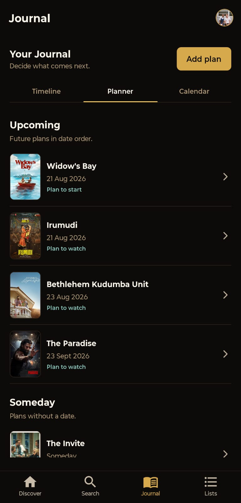
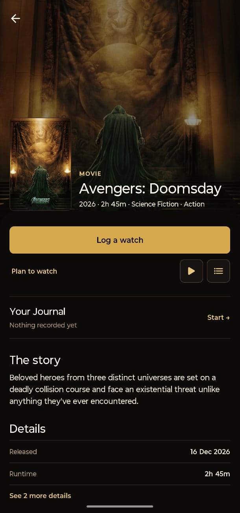
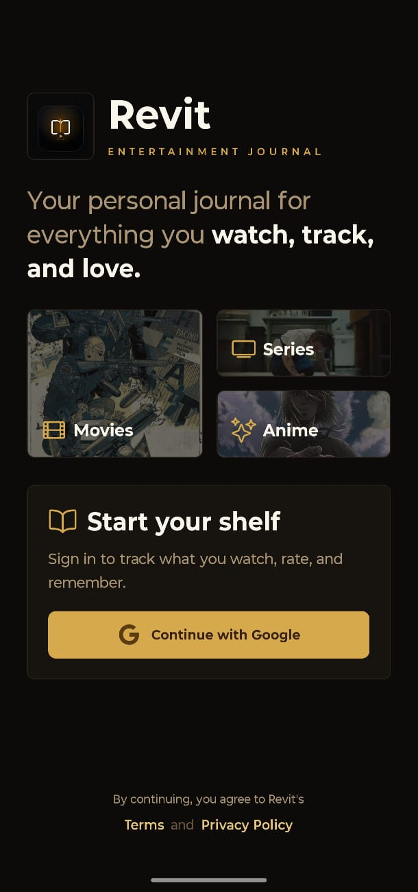
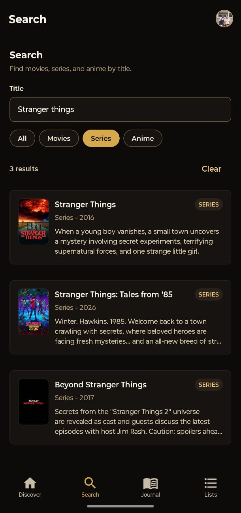
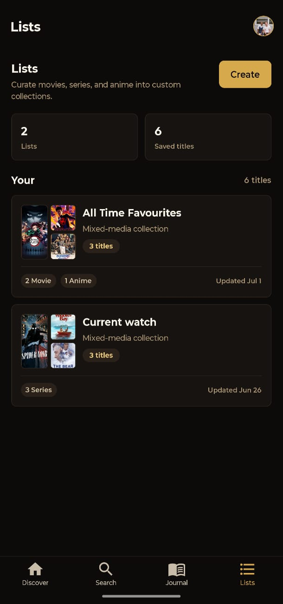
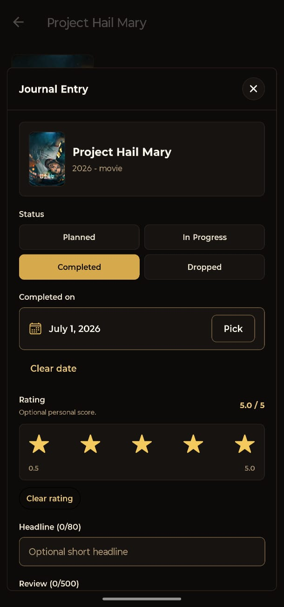

# Revit

Revit is a personal entertainment journal for movies, series, and anime.

I built it to keep everything I watch in one place—from titles I plan to start to the ones I have completed, rated, and reviewed.

[Get Revit on Google Play](https://play.google.com/store/apps/details?id=com.tarun.revit)

## Screenshots

<p>
  
  
  
  
  
  
  
  
</p>

## Features

- Browse and search for movies, series, and anime
- View posters, summaries, genres, and other title information
- Sign in with Google
- Plan what to watch next, log watches, and track your current viewing state
- Keep a private, dated watch history for each title, including rewatches
- Rate titles from 0.5 to 5 and add private notes
- Browse your Journal in Timeline, Planner, and Calendar views
- Filter Timeline activity by media type, event type, rating, and date
- Create lists containing different types of media
- Update profile details and avatar
- Access privacy, terms, and support pages
- Sign out or delete an account from within the app

## Built with

- Expo
- React Native
- TypeScript
- Expo Router
- NativeWind
- TanStack Query
- Supabase
- TMDB

TMDB requests are handled through Supabase Edge Functions so the TMDB credentials are not included in the mobile app.

## Running locally

Install the dependencies:

```bash
npm install
```

Create a `.env` file from the example:

```bash
cp .env.example .env
```

Add your Supabase project values:

```text
EXPO_PUBLIC_SUPABASE_URL=
EXPO_PUBLIC_SUPABASE_ANON_KEY=
```

Start the development server:

```bash
npm run start
```

Other available commands:

```bash
npm run android
npm run ios
npm run web
npm run typecheck
npm run lint
npm run check
```

## Links

- [Google Play](https://play.google.com/store/apps/details?id=com.tarun.revit)
- [Website](https://revit.tarunapps.com/revit/)
- [Privacy Policy](https://revit.tarunapps.com/revit/privacy/)
- [Terms of Use](https://revit.tarunapps.com/revit/terms/)
- [Support](https://revit.tarunapps.com/revit/support/)
