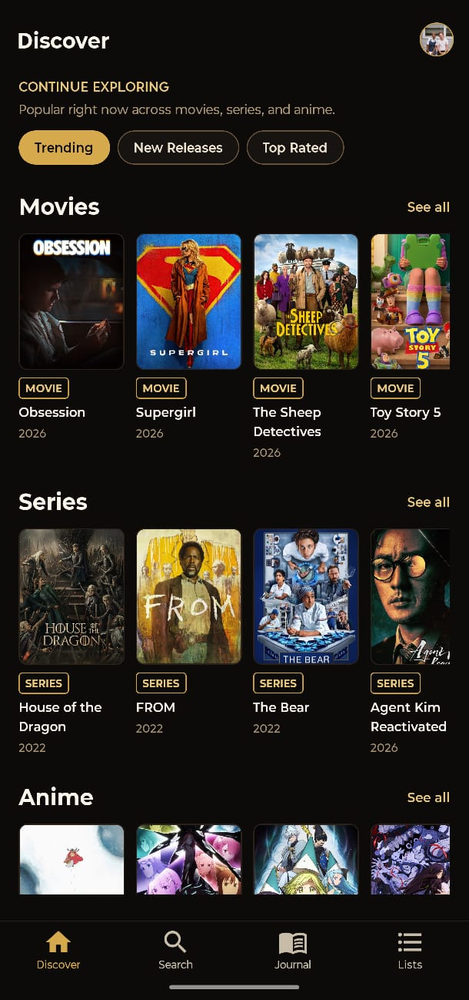
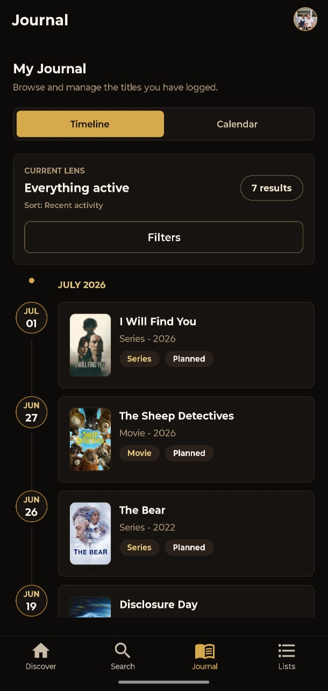

# Revit

Revit is a journal-first entertainment tracking app for movies, series, and anime. It is built as a production-ready Expo portfolio app where users can discover titles, save them to a personal journal, rate them, write short reviews, and organize mixed-media lists.

The app is intentionally personal and management-focused: Discover is the browsing surface, Journal is where entries live, Lists are for collections, and Profile/Account owns identity and account settings.

## Screenshots

<p>
  
  
  
  
  
  
</p>

Store-ready phone and tablet screenshots are also kept in `publish-store-assets/`.

## Features

- Production-ready auth shell with Google, Apple on iOS, and email OTP / magic link support.
- Onboarding flow for display name, username, and optional avatar.
- Discover and Search surfaces backed by normalized TMDB data through Supabase Edge Functions.
- Title details with poster art, summaries, metadata, journal state, and list actions.
- Add/Edit Journal Entry modal with status, 0.5-5.0 rating, short review, spoiler flag, and delete support.
- Journal Timeline and Calendar views with filters and sorting.
- Mixed-media custom lists with list details and item management.
- Profile/Account surface with profile editing, avatar updates, legal/support links, sign out, and account deletion.

## Stack

- Expo, React Native, TypeScript
- Expo Router
- NativeWind
- TanStack Query
- Supabase Auth, Postgres, Storage, and Edge Functions
- TMDB for movies, series, and anime metadata
- SQL migrations and generated Supabase database types

Games are planned for a later IGDB-backed expansion, but the media model is designed to stay extensible.

## Project Structure

```text
app/          Expo Router routes, layouts, tabs, modals, and pushed screens
components/   Shared UI, media, and feedback primitives
features/     Feature-owned screens, hooks, models, and API wrappers
lib/          Supabase, query, media, and shared infrastructure
supabase/     SQL migrations, Edge Functions, and seed docs
docs/         Product, architecture, phase, and release documentation
assets/       App icons, splash assets, and bundled image assets
```

## Getting Started

Install dependencies:

```bash
npm install
```

Create a local environment file:

```bash
cp .env.example .env
```

Fill in:

```text
EXPO_PUBLIC_SUPABASE_URL=
EXPO_PUBLIC_SUPABASE_ANON_KEY=
```

Start the app:

```bash
npm run start
```

Useful local commands:

```bash
npm run android
npm run ios
npm run web
npm run typecheck
npm run lint
npm run check
```

## Supabase Notes

The mobile client only uses the public Supabase URL and anon key. Third-party content access stays behind Supabase Edge Functions so private TMDB credentials are not shipped in the app.

Edge Function secrets should include:

```text
TMDB_ACCESS_TOKEN
SUPABASE_URL
SUPABASE_ANON_KEY
SUPABASE_SERVICE_ROLE_KEY
```

After applying database migrations, regenerate the app database types:

```bash
npx supabase gen types typescript --project-id <project-ref> --schema public > lib/supabase/types.ts
```

Then run:

```bash
npm run typecheck
```

## Release Assets

Release and publishing assets are organized under:

```text
publish-screenshots/
publish-store-assets/
aab/
```

The Expo/EAS configuration is in `app.json` and `eas.json`, with Android production builds configured as app bundles.

## Product Direction

Revit is scoped around a v1 journal loop:

1. Find a title.
2. Add it to the journal.
3. Track status.
4. Rate it.
5. Write a short review.
6. Revisit it through Timeline, Calendar, or Lists.

The project docs in `docs/` are the source of truth for stack decisions, feature scope, folder structure, database design, and phase planning.
